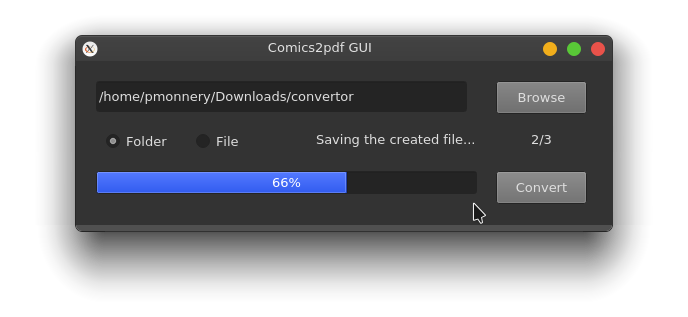

# comics2pdf
Python3 script and GUI to converts comic files (cbr, cbz) to pdf

## GUI
With the `comics2pdf_gui.py` file:

<p align="center">
  
</p>

## CLI

With the `comics2pdf.py` file:
```
$ poetry run ./comics2pdf.py

usage: comics2pdf.py [-h] (-d DIR | -f FILE) [--sync] [--output-dir OUTPUT_DIR] [--quality QUALITY] [--quiet]

Convert comic archives (CBZ/CBR) to PDF files

options:
  -h, --help            show this help message and exit
  -d DIR                Convert all comic files in directory
  -f FILE               Convert a single comic file
  --sync                Force synchronous processing (default is async for directories)
  --output-dir OUTPUT_DIR
                        Output directory for PDF files
  --quality QUALITY     Individual image quality
  --quiet               Suppress verbose output
```


### Running

Script need Python >= 3.10.  
Just run

```bash
poetry install
```
